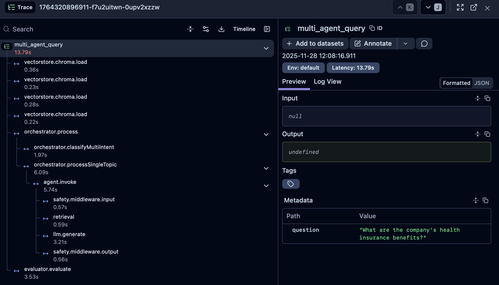
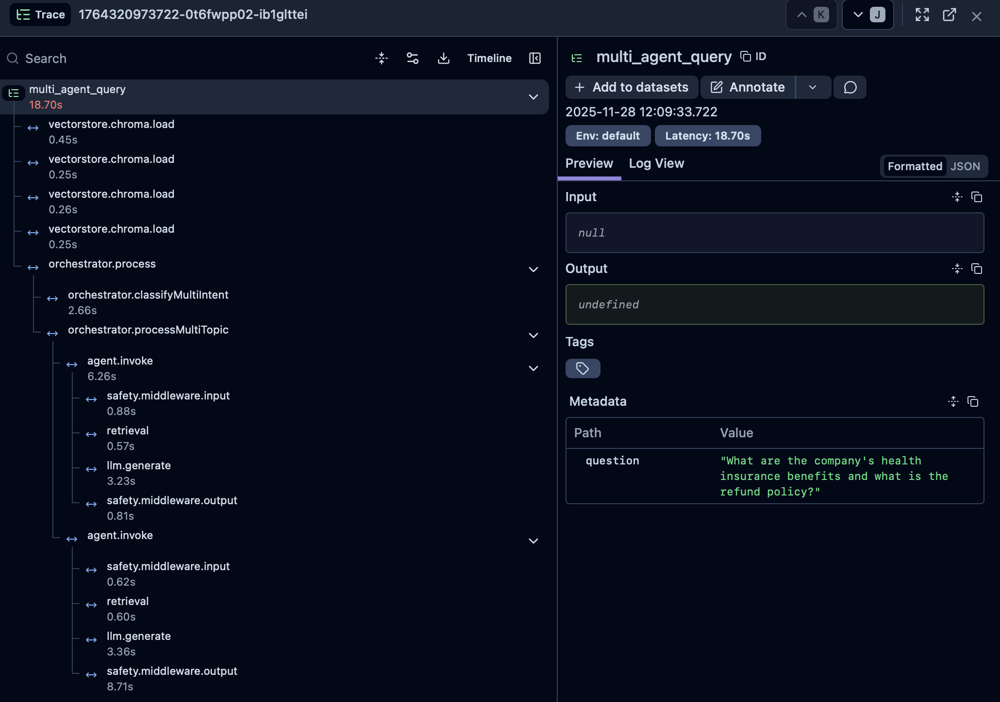

# Architecture

Multi-agent RAG system that routes queries to specialized agents using LangChain v1.

## System Overview

```
User Query → Orchestrator → Intent Classification → Specialized Agent → RAG Response
```

**Core Components:**
- **Orchestrator**: Routes queries to specialized agents
- **Specialized Agents**: HR, IT, Finance, Legal (each with own vector store)
- **RAG Chain**: Retrieval → Augmentation → Generation
- **Safety Middleware**: Input/output moderation, PII detection, injection prevention

## Key Features

- **Multi-Intent Classification**: Handles queries requiring multiple agents
- **Agent Handoffs**: Agents can transfer queries to other agents
- **Result Merging**: Combines responses from multiple agents
- **Conversation Memory**: Multi-turn conversation support
- **Lazy Loading**: Agents initialized on-demand
- **Observability**: Langfuse tracing and evaluation

## Architecture Layers

```
Entry Points (CLI)
    ↓
Orchestrator (Intent Classification & Routing)
    ↓
Specialized Agents (HR, IT, Finance, Legal)
    ↓
RAG Chain (Retrieval → Prompt → LLM)
    ↓
Infrastructure (Vector Store, LLM, Embeddings, Memory)
```

## Component Diagram

```
┌─────────────────────────────────────────────────────────────┐
│                      Entry Points                           │
├─────────────────────────────────────────────────────────────┤
│  index.ts (CLI)  │  conversation.ts (Interactive)         │
└─────────────────────────────────────────────────────────────┘
                            │
                            ▼
┌─────────────────────────────────────────────────────────────┐
│                    Orchestrator Layer                        │
├─────────────────────────────────────────────────────────────┤
│  ┌──────────────────┐  ┌──────────────────┐             │
│  │ OrchestratorAgent │  │ classifyIntent()   │             │
│  │                  │  │ classifyMultiIntent│             │
│  └────────┬─────────┘  └────────┬──────────┘             │
│           │                      │                          │
│           │  ┌──────────────────┴──────────┐             │
│           │  │ HandoffChain                 │             │
│           │  └───────────────────────────────┘             │
│           │  ┌───────────────────────────────┐             │
│           └──│ ResultMerger                  │             │
│              └───────────────────────────────┘             │
└─────────────────────────────────────────────────────────────┘
                            │
                            ▼
┌─────────────────────────────────────────────────────────────┐
│                      Agent Layer                            │
├─────────────────────────────────────────────────────────────┤
│  ┌──────────┐  ┌──────────┐  ┌──────────┐  ┌──────────┐ │
│  │HRAgent   │  │ITAgent   │  │Finance   │  │Legal     │ │
│  │          │  │          │  │Agent     │  │Agent     │ │
│  └────┬─────┘  └────┬─────┘  └────┬─────┘  └────┬─────┘ │
│       │             │             │             │         │
│       └─────────────┴─────────────┴─────────────┘         │
│                    │                                       │
│              ┌─────▼─────┐                                │
│              │BaseAgent   │                                │
│              └────────────┘                                │
└─────────────────────────────────────────────────────────────┘
                            │
                            ▼
┌─────────────────────────────────────────────────────────────┐
│                    RAG Chain Layer                          │
├─────────────────────────────────────────────────────────────┤
│  ┌──────────────┐  ┌──────────────┐  ┌──────────────┐    │
│  │ Retriever    │→ │ Prompt       │→ │ LLM          │    │
│  │ (Similarity/ │  │ Construction │  │ Generation   │    │
│  │  MMR/Comp)   │  │              │  │              │    │
│  └──────────────┘  └──────────────┘  └──────────────┘    │
│         │                                                  │
│         ▼                                                  │
│  ┌──────────────┐                                         │
│  │ Safety       │                                         │
│  │ Middleware   │                                         │
│  └──────────────┘                                         │
└─────────────────────────────────────────────────────────────┘
                            │
                            ▼
┌─────────────────────────────────────────────────────────────┐
│                  Infrastructure Layer                        │
├─────────────────────────────────────────────────────────────┤
│  ┌──────────────┐  ┌──────────────┐  ┌──────────────┐   │
│  │ Vector Store │  │ LLM Provider │  │ Embeddings   │   │
│  │ (ChromaDB)   │  │ (OpenAI)     │  │ (OpenAI)     │   │
│  └──────────────┘  └──────────────┘  └──────────────┘   │
│                                                             │
│  ┌──────────────┐  ┌──────────────┐  ┌──────────────┐   │
│  │ Memory       │  │ Cache        │  │ Logger       │   │
│  │ (Buffer/     │  │ (In-Memory)  │  │ (Pino)       │   │
│  │  Summary)    │  │              │  │              │   │
│  └──────────────┘  └──────────────┘  └──────────────┘   │
└─────────────────────────────────────────────────────────────┘
                            │
                            ▼
┌─────────────────────────────────────────────────────────────┐
│                  Observability Layer                        │
├─────────────────────────────────────────────────────────────┤
│  ┌──────────────┐  ┌──────────────┐  ┌──────────────┐   │
│  │ Langfuse     │  │ Callbacks    │  │ Metrics      │   │
│  │ (Tracing)    │  │ (Auto-trace) │  │ (Counts/     │   │
│  │              │  │              │  │  Timings)    │   │
│  └──────────────┘  └──────────────┘  └──────────────┘   │
└─────────────────────────────────────────────────────────────┘
```

## Query Processing Flow

### Single Intent Flow

```
┌─────────────┐
│ User Query  │
└──────┬──────┘
       │
       ▼
┌─────────────────────────────────────┐
│  Safety Middleware (Input Check)    │
│  ├─ Content Moderation              │
│  ├─ PII Detection & Redaction       │
│  └─ Injection Detection             │
└──────┬──────────────────────────────┘
       │
       ▼
┌─────────────────────────────────────┐
│  Orchestrator Agent                 │
│  ├─ Intent Classification          │
│  │  └─ LLM (structured output)     │
│  ├─ Confidence Calculation         │
│  └─ Agent Selection                │
└──────┬──────────────────────────────┘
       │
       ▼
┌─────────────────────────────────────┐
│  Specialized Agent (e.g., HR)     │
│  ├─ Retrieve Documents             │
│  │  └─ Vector Search (topK=5)      │
│  ├─ Context Compression (optional) │
│  ├─ Prompt Construction            │
│  └─ LLM Generation                 │
└──────┬──────────────────────────────┘
       │
       ▼
┌─────────────────────────────────────┐
│  Handoff Check                     │
│  ├─ Handoff Request?               │
│  │  ├─ Yes → HandoffChain          │
│  │  └─ No → Continue               │
└──────┬──────────────────────────────┘
       │
       ▼
┌─────────────────────────────────────┐
│  Safety Middleware (Output Check)   │
│  ├─ Content Moderation (optional)  │
│  └─ PII Detection (optional)        │
└──────┬──────────────────────────────┘
       │
       ▼
┌─────────────────────────────────────┐
│  Evaluator Agent (optional)         │
│  ├─ Quality Scoring                │
│  └─ Score Recording (Langfuse)      │
└──────┬──────────────────────────────┘
       │
       ▼
┌─────────────────────────────────────┐
│  Response Formatting                │
│  ├─ Answer                          │
│  ├─ Sources                         │
│  ├─ Metadata                        │
│  ├─ Handoff Chain (if occurred)    │
│  └─ Evaluation (if enabled)        │
└──────┬──────────────────────────────┘
       │
       ▼
┌─────────────┐
│   Response  │
└─────────────┘
```

### Multi-Intent Flow

```
┌─────────────┐
│ User Query  │
└──────┬──────┘
       │
       ▼
┌─────────────────────────────────────┐
│  Safety Middleware (Input Check)    │
└──────┬──────────────────────────────┘
       │
       ▼
┌─────────────────────────────────────┐
│  Orchestrator Agent                 │
│  ├─ Multi-Intent Classification     │
│  ├─ Sub-Query Generation            │
│  │  ├─ Intent 1: "HR benefits?"     │
│  │  └─ Intent 2: "Reset password?" │
│  └─ Multiple Agent Selection        │
└──────┬──────────────────────────────┘
       │
       ▼
┌─────────────────────────────────────┐
│  Parallel Execution                 │
│  (RunnableParallel)                 │
│  ┌──────────┐      ┌──────────┐    │
│  │ HRAgent  │      │ ITAgent  │    │
│  │          │      │          │    │
│  │ Response │      │ Response │    │
│  └────┬─────┘      └────┬─────┘    │
│       │                 │           │
│       └────────┬────────┘           │
│                │                    │
└────────────────┼────────────────────┘
                 │
                 ▼
┌─────────────────────────────────────┐
│  Result Merger                      │
│  ├─ Strategy Selection              │
│  │  ├─ Concatenation (fast)         │
│  │  ├─ LLM Synthesis (coherent)    │
│  │  └─ Structured (organized)      │
│  ├─ Response Combination            │
│  └─ Source Aggregation              │
└──────┬──────────────────────────────┘
       │
       ▼
┌─────────────────────────────────────┐
│  Safety Middleware (Output Check)   │
└──────┬──────────────────────────────┘
       │
       ▼
┌─────────────────────────────────────┐
│  Evaluator Agent (optional)         │
└──────┬──────────────────────────────┘
       │
       ▼
┌─────────────────────────────────────┐
│  Merged Response                    │
│  ├─ Combined Answer                 │
│  ├─ Sources (grouped by intent)     │
│  ├─ Metadata (agents, intents)      │
│  └─ Evaluation (if enabled)        │
└──────┬──────────────────────────────┘
       │
       ▼
┌─────────────┐
│   Response  │
└─────────────┘
```

### Handoff Flow

```
┌─────────────────────────────────────┐
│  Initial Agent Processing          │
│  (e.g., HRAgent)                   │
│  ├─ Query received                 │
│  ├─ Determines needs LegalAgent    │
│  └─ Returns handoffRequest        │
└──────┬──────────────────────────────┘
       │
       ▼
┌─────────────────────────────────────┐
│  HandoffChain Processing             │
│  ├─ Validate handoff                │
│  │  ├─ Prevent loops                │
│  │  └─ Check max depth (default: 2) │
│  ├─ Build handoff context           │
│  │  ├─ Original query               │
│  │  └─ Agent A's partial response  │
│  └─ Route to Agent B                │
└──────┬──────────────────────────────┘
       │
       ▼
┌─────────────────────────────────────┐
│  Target Agent Processing            │
│  (e.g., LegalAgent)                 │
│  ├─ Receives handoff context        │
│  ├─ Processes with full context     │
│  └─ Returns complete response       │
└──────┬──────────────────────────────┘
       │
       ▼
┌─────────────────────────────────────┐
│  Response Formatting                │
│  ├─ Answer from Agent B             │
│  ├─ handoffOccurred: true           │
│  ├─ handoffChain: ["hr", "legal"]   │
│  └─ Sources from both agents        │
└──────┬──────────────────────────────┘
       │
       ▼
┌─────────────┐
│   Response  │
└─────────────┘
```

## Technical Decisions

### LangChain LCEL
- Declarative chain composition
- Type safety through pipeline
- Built-in streaming support
- Automatic observability integration

### Structured Output for Classification
- `withStructuredOutput()` with function calling
- Zod schemas for validation
- Returns intent + confidence + reasoning
- More reliable than JSON mode

### ChromaDB Vector Store
- Separate collections per agent (domain isolation)
- Self-hosted (Docker)
- Simple deployment, no external dependencies

### Retrieval Strategy
- Default: Cosine similarity search (topK=5, threshold=0.5)
- Alternatives: MMR, compression
- Chunk size: 800 tokens, overlap: 100 tokens
- Minimum 50 chunks per domain

### Multi-Intent Support
- Separate classifier chain
- Generates sub-queries per intent
- Parallel execution for performance
- Configurable merge strategies

### Temperature Settings
- Classification: 0.1 (deterministic)
- Generation: default (~0.7-1.0, natural responses)

## Component Details

### Orchestrator
- `OrchestratorAgent`: Routes queries, manages handoffs, merges results
- `classifyIntent()` / `classifyMultiIntent()`: LLM-based classification functions (single/multi-intent)
- `HandoffChain`: Processes agent transfers
- `ResultMerger`: Combines multi-agent responses

### Agents
- `BaseAgent`: Abstract RAG agent with safety middleware
- Specialized: `HRAgent`, `ITAgent`, `FinanceAgent`, `LegalAgent`
- `AgentRegistry`: Lazy loading factory

### RAG Chain
- Retrievers: Similarity, MMR, Compression
- Prompts: RAG, classification, evaluation
- Safety middleware wraps chains

### Infrastructure
- Vector Stores: ChromaDB (production), Memory (testing)
- LLM: OpenAI GPT models
- Embeddings: OpenAI text-embedding-3-small
- Memory: Buffer or summary-based conversation memory
- Cache: In-memory response caching

### Safety
- Input: Moderation, PII detection, injection prevention
- Output: Optional moderation and PII checks
- LangChain middleware pattern

### Observability
- Langfuse: Distributed tracing, score tracking
- Structured logging (Pino)
- Metrics: Operation counts, timings, error rates

#### Langfuse Tracing

Langfuse provides comprehensive distributed tracing for the entire query processing pipeline, enabling visibility into:
- Intent classification and routing decisions
- Agent execution and RAG chain operations
- Multi-agent coordination and result merging
- Handoff chains and agent transfers
- Evaluation scores and quality metrics

**Single Topic Query Tracing:**


**Multi-Topic Query Tracing:**


**Conversation with Single Topic:**


## Configuration

Environment variables via `src/config/env.ts`:
- LLM: Model, temperature, API keys
- Vector Store: Type, connection, collections
- Retrieval: Strategy, topK, threshold
- Safety: Enable/disable checks, PII strategy
- Performance: Cache, memory, chunking
- Observability: Langfuse credentials, log levels

## Error Handling

Custom error hierarchy:
- `RAGError` (base)
- `ConfigurationError`, `VectorStoreError`, `LLMError`, etc.

Resilience patterns:
- Circuit breaker for LLM calls
- Exponential backoff retry
- Timeout handling

## Extension Points

**Add New Agent:**
1. Extend `BaseAgent`
2. Add intent to classifier schema
3. Register in orchestrator
4. Create vector store collection

**Add New Retriever:**
1. Implement retriever function
2. Add to factory
3. Add config option

**Add New Vector Store:**
1. Implement interface
2. Add to factory
3. Update config

## Deployment

**Development:**
- Local ChromaDB (Docker)
- Debug logging
- Hot reload

**Production:**
- Persistent ChromaDB
- JSON logging
- Error monitoring
- Rate limiting (if API)

**Scaling:**
- Stateless agents (except memory)
- Distributed ChromaDB for vector store
- External session store for memory
